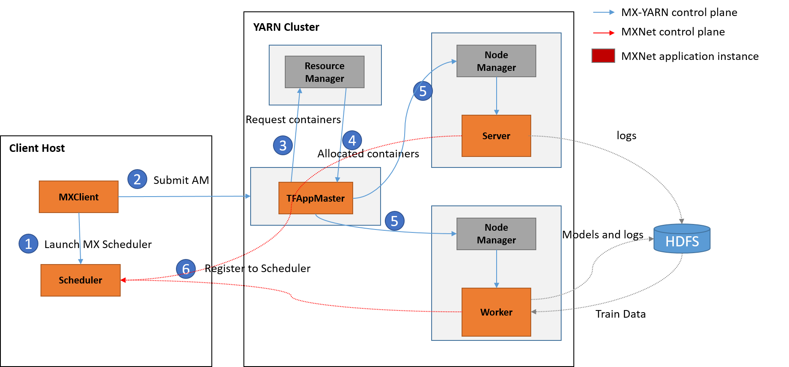

# MXNetOnYARN
MXNet on YARN is a project based on [dmlc-core](https://github.com/dmlc/dmlc-core) and [MXNet](https://github.com/dmlc/mxnet), aiming at running MXNet on YARN with high efficiency and flexibility. It's an important part of Deep Learning on Hadoop ([HDL](https://github.com/Intel-bigdata/HDL)). 

**Note that both the codebase and documentation are work in progress. They may not be the final version.**

## Overview

Performing large scale training or predicting tasks with high efficiency is always a big challenge in machine learning and deep learning. Because in most cases, training datasets, computation graphs or variables etc, are always too large for single node. To address this issue, distributed support (or enabling) on current cluster environments, i.e., Hadoop YARN, is very import for current deep learning frameworks. 

In this project, we proposed **MXNetOnYARN** to enable MXNet distributed training and serving on Hadoop YARN, which has been used successfully to run all sorts of distributed data applications. 


With the help of MXNetOnYARN, users can submit multiple MXNet training or serving tasks to existing YARN cluster **without any modifications on jobs or any worry about building environment or dependencies**, etc. MXNetOnYARN will handle all details about distributed machine learning with high efficiency and flexibility. When the tasks are finished, all resources  will be released, with results and logs be saved to HDFS.

## How To

This note describes how to deploy and run the training on Yarn.

**The basic command is as follows:**

```bash
ydl-mx yarn [cluster_command] [task_command]
```
Users can use this command to submit training or serving tasks with specific parameters or datasets. Note that 

`cluster_command` is used to specifies the distributed environment, e.g., number of workers and servers launched. Normally, users only needs to specify the number of workers, then MXNetOnYARN will launch the same number of servers. So `-n 2` means launch 2 workers and 2 server, while `-n 2 -s 1` means launch 2 workers and 1 server.

`task_command` is the command that specifies the detailed configure of machine learning tasks, e.g., `job.py --kv-store sync --data-dir` for distributed training. The basic format is similar to single node MXNet tasks without `python` prefix. So, all MXNet parameters are supported, and can be added to `task_command`.

### Pre-Preparation


**1. Distribution support in your MXNet jobs**

In your code, modify demos with [distribution support](http://mxnet.io/how_to/multi_devices.html) (e.g., `train_mnist.py`), or add create a `kvstore` and explicitly set it in your model.

	kv = mx.kvstore.create('dist_sync')
	model = mx.model.FeedForward.create(symbol = net, X = data, kvstore = kv, ...)
	
The use of parameter server is based on the [kvstore class](http://mxnet.io/api/python/kvstore.html) in MXNet.	

**2. Build `yarn.jar`**

1. Deploy HDFS and Yarn system. For convenience, we usually set the HDFS namenode and Yarn resourcemanager to be on the same machine.
2. Set environment variables in `/etc/profile`. The variables need to be set are: `JAVA_HOME`, `HADOOP_HOME`, `HADOOP_HDFS_HOME`, `LD_LIBRARY_PATH`. For CDH Hadoop version, you have to download all the hadoop jars and add all these jar files in `CLASSPATH` variable.
3. If you are using CDH Hadoop, download the `libhdfs.so` and copy it to `LD_LIBRARY_PATH` folder.
4. Set `USE_HDFS = 1`, `USE_DIST_KVSTORE = 1` in MXNet `config.mk` before compilation.
5. Run `hadoop-yarn-applications-mxnet/build.sh` to compile Yarn ApplicationMaster and Client.

### How to Run

For example, we can submit the application like this:

	/bin/ydl-mx --cluster yarn --num-workers 1 --num-servers 1 --jobname MXNetOnYarn --yarn-app-dir yarn/ python train_minist.py --kv-store sync --data-dir .

**`cluster_command`**:

	`--cluster` specifies the ip address of resourcemanager
	`--jobname` specifies the name of job
	`--num-workers` specifies the number of workers
	`--num-servers` specifies the number of servers
	`--yarn-app-dir` specifies the folder for `yarn.jar`.
	

**`task_command`**

	`python train_minist.py --kv-store sync --data-dir .` is the command to execute the mnist.py

There is a tricky point here. Let's suppose the number of workers is n and the number of servers is `m`. The number of containers available in the cluster should be no less than `m+n+1` because the ApplicationMaster also need one container to run.  

### Fault Tolerance
In current ApplicationMaster, whole application will be killed if some of containers fails. You can add the fault tolerance feature by adding a blacklist in ApplicationMaster. Each time one container fails, the node should be added to the blacklist and never be used for execution.


## MXNetonYARN Basic Design

### Basic Design

Here is the basic design of MXNetOnYARN:


We can see that After users submitted MXNet jobs on client node, MXNetOnYARN will do the following steps:

1. Launch a scheduler on client node. 
2. Client node submit MXNetAPPMaster container.
3. MXNetAPPMaster sends request to `Resource Manager (RM)` for more containers
4. RM contacts with Node Managers, and send allocated containers to MXNetAPPMaster
5. MXNetAPPMaster contacts with Node managers, and launches allocated containers.
6. Containers launches MXNet workers and servers, which registers to Scheduler after being launched.


### Support for Current YARN Environment
MXNet requires a bundle of third-part packages and dependencies, which are not normally installed in industrial environment. To address this issue, we introduce three solutions:

1. **Docker Solution (Easy to Deploy and Support)** with all dependencies pre-built in images.
2. **Native Solution (Highest Performance)** with all workers and servers running in native or JVM env.
3. **Labeled Solution (Test or Experimental Deployment)** with all dependencies installed on some cluster nodes

Note that Docker Solution needs minimum changes if docker ecosystem is already setup on YARN, but it needs extra resources for docker containers. On the other hand, Native Solution promise highest efficiency with a few modifications, but it relies on other native APIs, e.g., MXNet CPP or Scala APIs, which are not full accomplished. Last but not least, Labeled Solution requires minimum changes on current environment, which is suggested for test or experimental deployment, but its capability is limited by the number of labeled nodes.

#### Docker Support


#### Native Support (without Python)
**Note that this part is under modification, some details may be not final.** 

#### Labeled Python nodes

### Serving (Inference)

## Discussion

## References


