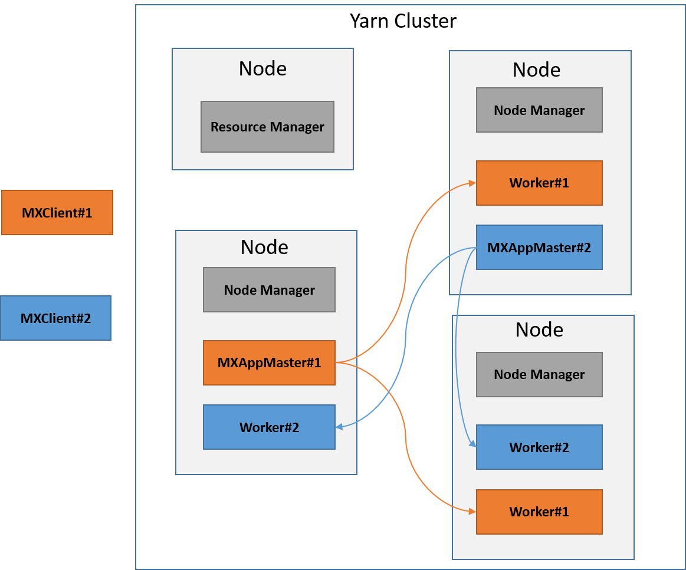

# MXNetOnYARN
MXNet on YARN is a project based on [dmlc-core](https://github.com/dmlc/dmlc-core) and [MXNet](https://github.com/dmlc/mxnet), aiming at running MXNet on YARN with high efficiency and flexibility. It's an important part of Deep Learning on Hadoop ([HDL](https://github.com/Intel-bigdata/HDL)). 

**Note that both the codebase and documentation are work in progress. They may not be the final version.**

## Overview

Performing large scale training or predicting tasks with high efficiency is always a big challenge in machine learning and deep learning. Because in most cases, training datasets, computation graphs or variables etc, are always too large for single node. To address this issue, distributed support (or enabling) on current cluster environments, i.e., Hadoop YARN, is very import for current deep learning frameworks. 

In this project, we proposed **MXNetOnYARN** to enable MXNet distributed training and serving on Hadoop YARN, which has been used successfully to run all sorts of distributed data applications. 



With the help of MXNetOnYARN, users can submit multiple MXNet training or serving tasks to existing YARN cluster **without any modifications on jobs or any worry about building environment or dependencies**, etc. MXNetOnYARN will handle all details about distributed machine learning with high efficiency and flexibility. When the tasks are finished, all resources  will be released, with results and logs be saved to HDFS.

## How-To

This note describes how to deploy and run the training on Yarn.

**The basic command is as follows:**

```bash
ydl-mx [cluster_option] [task_option]
```
Users can use this command to submit training or serving tasks with specific parameters or datasets. Note that 

`cluster_option` is used to specify the distributed environment, e.g., number of workers and servers launched. Normally, users only needs to specify the number of workers, then MXNetOnYARN will launch the same number of servers. So `--n 2` means launch 2 workers and 2 server, while `--n 2 --s 1` means launch 2 workers and 1 server.

`task_option` is used to specify the detailed configure of machine learning tasks, e.g., `job.py --kv-store sync --data-dir` for distributed training. The basic format is similar to single node MXNet tasks without `python` prefix. So, all MXNet parameters are supported, and can be added to `task_option`.

### Pre-Preparation


**1. Distribution Support in your MXNet jobs**

In your code, modify demos with [distribution support](http://mxnet.io/how_to/multi_devices.html) (e.g., `train_mnist.py`), or add create a `kvstore` and explicitly set it in your model.

	kv = mx.kvstore.create('dist_sync')
	model = mx.model.FeedForward.create(symbol = net, X = data, kvstore = kv, ...)
	
The use of parameter server is based on the [kvstore class](http://mxnet.io/api/python/kvstore.html) in MXNet.	

### How to Run

For example, we can submit the application like this:

	/bin/ydl-mx --n 2 --jobname MXNetOnYarn --jar ydl-mx.jar train_minist.py --kv-store sync --data-dir .

**`cluster_option`**:

	`--jobname` specifies the name of job
	`--n` specifies the number of workers and servers
	`--jar` specifies the path for `ydl-mx.jar`.
	

**`task_option`**

	train_minist.py --kv-store sync --data-dir .
	
This command is used to execute the `mnist.py` example with distributed support, i.e., `--kv-store sync`.

### Serving (Inference)


## References


